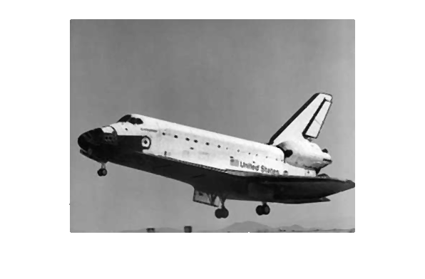
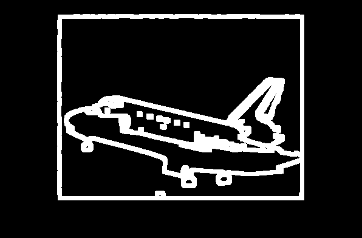
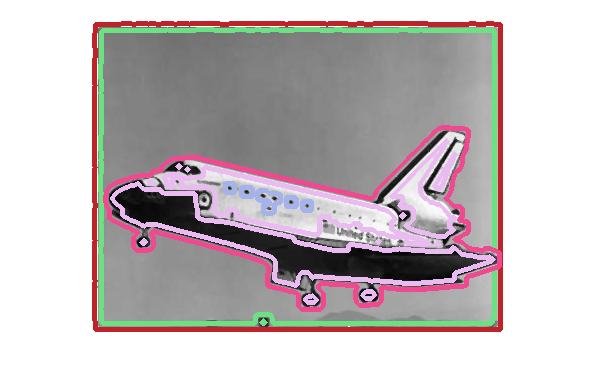

Input image is a gray scale image with high level of salt and pepper noise.

<kbd>

</kbd>

There are many techniques for removal of salt and pepper noise such as median filters, bilateral filter, and more advanced techniques based on adaptive edge detection and deep learning. For this particular image median filter with a kernel size of 3x3 just worked fine.

Image after applying median blur:

<kbd>

</kbd>

In the next step Canny edge detection algorithm is applied to detect all the edges. This step is followed by a dilation step.
Dilation step helps to force the edges to cover the entire objects that is needed for the next step.

Image of detected and dilated edges:

<kbd>

</kbd>

Next, we can find and rank the contours in the image. Using openCV, we can use a tree-based algorithm to find the hierachy of the contours. This will return all the contours while also perserving the child-parent relationship between the contours. This helps for example when we want to enclose an entire object by its boundry and we want clear separation between the outline boundry and boundries that belong to the inside of the image.

After finding the contours and their hierachy, since our hierachy is tree-based, we can do a DFS on the contours and color them based on their level of traversal. 

Image of colored contours of the image:

<kbd>

</kbd>

We can note that the entire outline of the the shuttle body is illustrated by a different color than other contours for example for the wings.

Changing the parameters for example for canny threshold, and dilation level can result in other interesting results.
